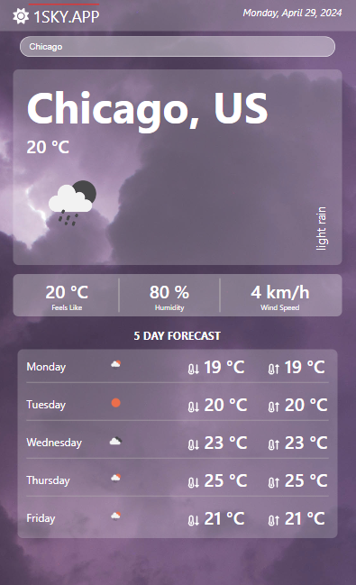

## MOBILE WEATHER APP

## Live Demo
Check out the live on your phone: 

https://weather-mobile-app.netlify.app/

# Description

Welcome to the Weather Mobile App! This mobile application provides real-time weather forecasts and information right at your fingertips. With a sleek and intuitive user interface, you can easily check the current weather conditions, view hourly and daily forecasts, and stay updated on weather alerts for your location. Whether you're planning your day or preparing for outdoor activities, the Weather Mobile App has you covered.

## Features
- **Real-time Weather Forecasts**: Get up-to-date weather information for your location.
- **Hourly and Daily Forecasts**: View detailed forecasts for the next few hours and days.
- **Weather Alerts**: Stay informed about weather alerts and warnings affecting your area.

## Technologies Used
- **Frontend**: 
  - [React Native](https://reactnative.dev/)
  - [Axios](https://axios-http.com/)
  - [Moment.js](https://momentjs.com/)
  - [Fonts Icons](https://fontawesome.com/)
  - [Vite](https://vitejs.dev/)
  - [Sass](https://sass-lang.com/)

- **API**: 
  - [OpenWeatherMap API](https://openweathermap.org/api)

## Getting Started
To run the Weather Mobile App locally, ensure that you have the following prerequisites installed:

- **Node.js**: Make sure you have Node.js installed on your machine. You can download it from [here](https://nodejs.org/).
- **Git**: Ensure Git is installed on your machine. You can download it from [here](https://git-scm.com/).
- **OpenWeatherMap API Key**: Sign up for an API key at [OpenWeatherMap](https://openweathermap.org/api) and replace `"YOUR_API_KEY"` in the `config.js` file with your actual API key.

Once you have the prerequisites installed, follow these steps:

1. **Clone the Repository**: Clone this repository to your local machine.
2. **Install Dependencies**: Navigate to the project directory and run `npm install` to install all required dependencies.
3. **Set Up API Key**: Replace `"YOUR_API_KEY"` in the `config.js` file with your actual OpenWeatherMap API key.
4. **Allow Geo Location**: Make sure to allow location access when prompted. This is necessary for the app to fetch weather data for your current location.
5. **Start the Development Server**: Run `npm start` to start the development server.
6. **Launch the App**: Open the project in an iOS or Android emulator, or use any other method you prefer to run React Native apps.

## Feedback and Contributions
Feedback and contributions are welcome! If you have any suggestions for improving the Weather Mobile App or would like to contribute to its development, please feel free to submit a pull request or open an issue on GitHub.

## License
This project is licensed under the [MIT License](LICENSE).

